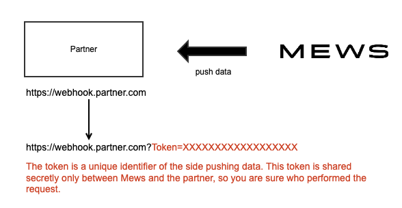

# Webhooks

Webhooks provides another way to communicate with Mews.
A Webhook is a web address that your application registers with the Mews API to receive event-based messages.
It is also known as a web callback, because Mews 'calls back' the client application when an event occurs.
For a fuller explanation of Webhooks and how they differ from [WebSockets](../websockets/README.md) and normal API [Operations](../operations/README.md), see [Ways to communicate](../guidelines/communicate.md).

Like normal requests to API endpoints in the __Mews Connector API__, the Webhook message will be made as a request using `HTTP POST` and with the details of the message in the JSON body. 

Mews currently supports two types of Webhook:

* [General Webhooks](wh-general.md) - a single webhook request encapsulating multiple types of event
* [Integration Webhooks](wh-integration.md) - individual webhooks related solely to integration events

## Webhooks FAQ

* [How do I register a Webhook with Mews?](#how-do-i-register-a-webhook-with-mews)
* [Are there special considerations for setting up a Webhook server?](#are-there-special-considerations-for-setting-up-a-webhook-server)
* [How can I authenticate Mews?](#how-can-i-authenticate-mews)
* [How should the server respond to a Webhook request?](#how-should-the-server-respond-to-a-webhook-request)
* [When should I use Webhooks?](#when-should-i-use-webhooks)
* [How are Webhooks different to WebSockets?](#how-are-webhooks-different-to-websockets)
* [What events can I create Webhooks for?](#what-events-can-i-create-webhooks-for)
* [What does an event message look like?](what-does-an-event-message-look-like)
* [What is the frequency of event generation?](#what-is-the-frequency-of-event-generation)
* [Can I see what Webhooks are configured?](#can-i-see-what-webhooks-are-configured)
* [Can I set up multiple Webhooks?](#can-i-set-up-multiple-webhooks)
* [Can I use Webhooks in an on-premise application?](#can-i-use-webhooks-in-an-on-premise-application)
* [Is it possible to disable sending some messages to Webhooks?](#is-it-possible-to-disable-sending-some-messages-to-webhooks)
* [Can you give me a specific use case for Webhooks?](#can-you-give-me-a-specific-use-case-for-webhooks)
* [Is there a limit on the number of events in one Webhook?](#is-there-a-limit-on-the-number-of-events-in-one-webhook)
* [I want an event not currently supported](#i-want-an-event-not-currently-supported)

### How do I register a Webhook with Mews?

Email [partnersuccess@mews.com](mailto://partnersuccess@mews.com) with details of your Webhook endpoint URL.

### Are there special considerations for setting up a Webhook server?

There are no special considerations for setting up a Webhook server.
It simply needs to be an endpoint that is accessible to the Mews system and can receive and process incoming HTTP requests with JSON content-type.
No special content-type headers are used.

### How can I authenticate Mews?

To confirm that a request to your Webhook endpoint originates from Mews, we can add a shared secret token to the URL, as follows:

#### Figure 1: Webhook Authentication

To use this authentication, let us know the details via [partnersuccess@mews.com](mailto://partnersuccess@mews.com).
The token should be kept secret and not shared with anyone except Mews.

### How should the server respond to a Webhook request?

HTTP status codes should be returned as normal, e.g. you can use HTTP status code 200 or 202 to indicate success.
You should send 400 codes and 500 codes as normal for different failure conditions.
Note that if an event message fails to be delivered (either a timeout occurs or an HTTP error code is received), then the message will be re-sent after an interval delay, but after three failed attempts it will be abandoned.

### When should I use Webhooks?

See [Ways to communicate](../guidelines/communicate.md).

### How are Webhooks different to WebSockets?

See [Ways to communicate](../guidelines/communicate.md).

### What events can I create Webhooks for?

See the Webhook reference pages for the list of currently supported events:

* [General Webhooks](wh-general.md)
* [Integration Webhooks](wh-integration.md)

### What does an event message look like?

See the Webhook reference pages for details of the request body:

* [General Webhooks](wh-general.md)
* [Integration Webhooks](wh-integration.md)

### What is the frequency of event generation?

The frequency at which events are created in the Mews system depends on the type of event and on the level of activity.
Note however there may be a time lag of up to several minutes from when the event occurs to when the actual Webhook request is made.
See [When are Webhooks generated?](../guidelines/communicate.md#when-are-webhooks-generated).

### Can I see what Webhooks are configured?

Webhooks are set up in the system administration, please contact [partnersuccess@mews.com](mailto://partnersuccess@mews.com) for information about what Webhooks are configured on the system for your application.

### Can I set up multiple Webhooks?

Only one endpoint URL for [General Webhooks](wh-general.md) and one endpoint URL for [Integration Webhooks](wh-integration.md) can be set up per integration client, i.e. per partner application.
If you wish, you can use the same endpoint URL for both types of Webhook.

### Can I use Webhooks in an on-premise application?

Although possible, it is generally not recommended for on-premise solutions to use Webhooks,
because we may update the API once or twice a year which may require updates to your application.
In that case, if pushing the updates to the on-premise solution is difficult then the solution won't scale well.

### Is it possible to disable sending some messages to Webhooks?

Yes. Event messages are configured for each integration, please contact [partnersuccess@mews.com](mailto://partnersuccess@mews.com) with your requirements and they can configure only the messages you want to receive.

### Can you give me a specific use case for Webhooks?

A specific use case for Webhooks is described in [Event management - Managing availability block inventory and pickup](../use-cases/event-management.md#managing-availability-block-inventory-and-pickup),
but Webhooks are relevant to many use cases and are discussed in the relevant section - see [Use cases](../use-cases/README.md).

### Is there a limit on the number of events in one Webhook?

[General Webhooks](wh-general.md) carry multiple events that have occurred at the same time.
Yes, there is an upper limit on the number of messages carried, before rolling over to a new message.
This number is a system parameter, currently in the order of hundreds, but Mews reserves the right to adjust this value for performance reasons.

### I want an event not currently supported

The list of supported events is always under review and may be extended in future.
If there is a system event that you are particularly interested in, please submit your request via the Mews [Product Ideas Forum](https://feedback.mews.com/).
We can't provide any guarantees, but we are very interested to know what kind of features our customers and partners are requesting.
